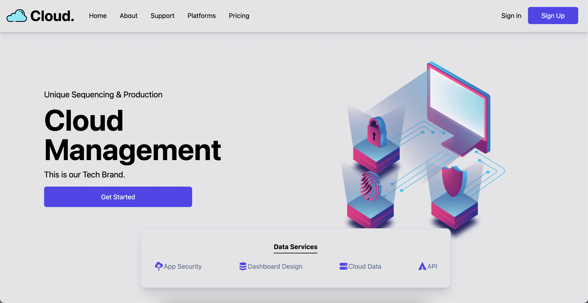
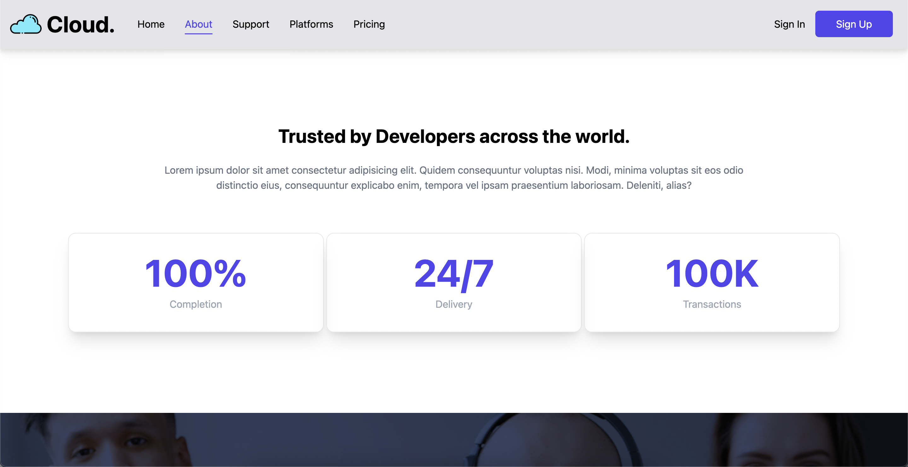
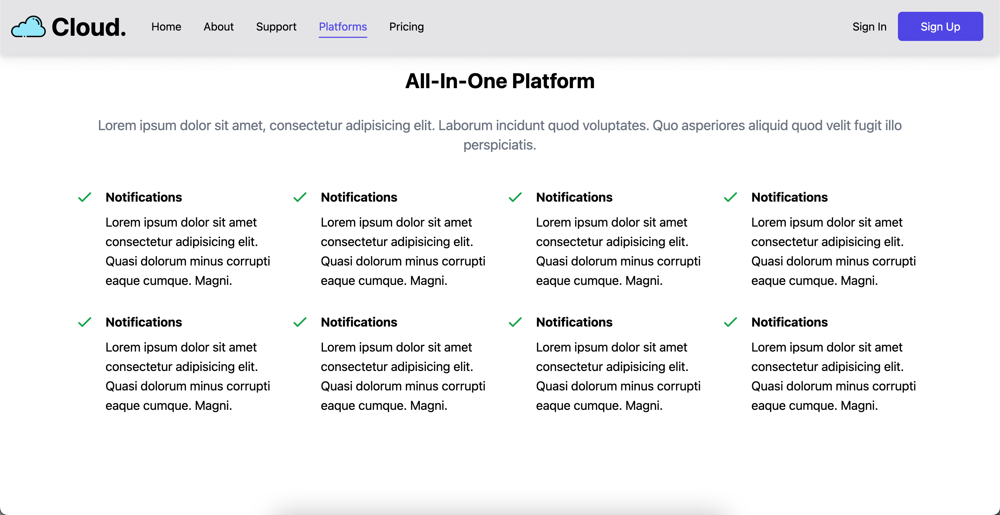
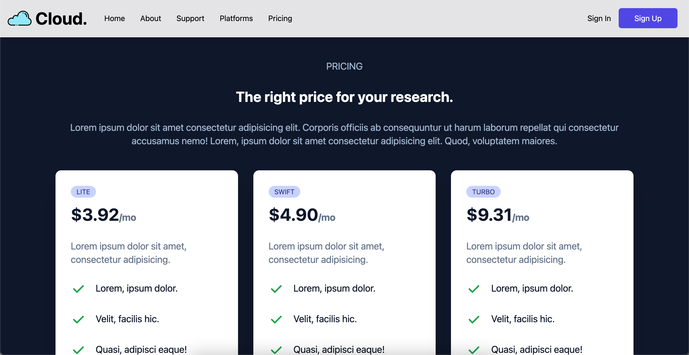

<h1 align="center" style="font-style:italic;">Admin Dashboard</h1>

## Download

Using Command :

```sh
git clone https://github.com/princu09/cloud-app-reactjs.git
```

Direct Zip :

[](https://github.com/princu09/cloud-app-reactjs/archive/refs/heads/Main.zip)


**Screenshot :**

* Dark Mode




